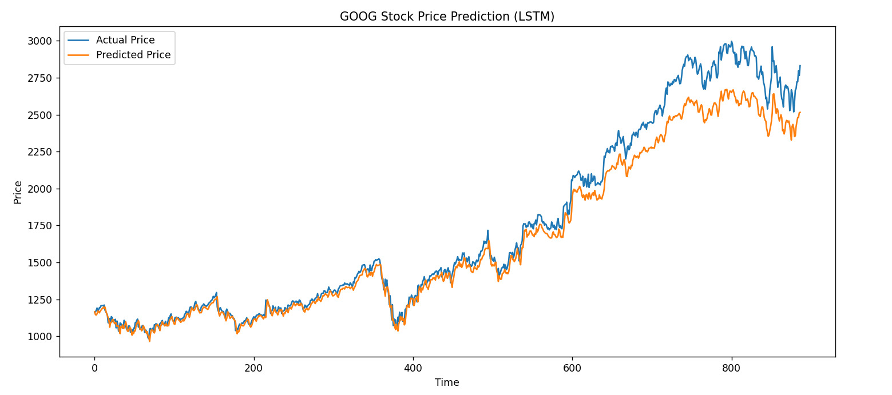
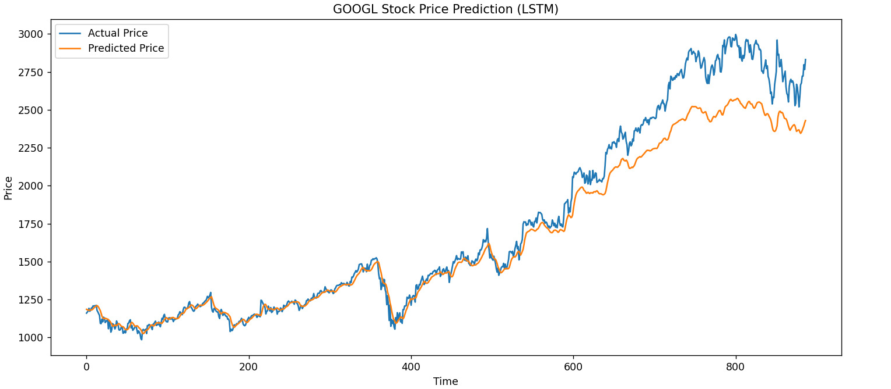
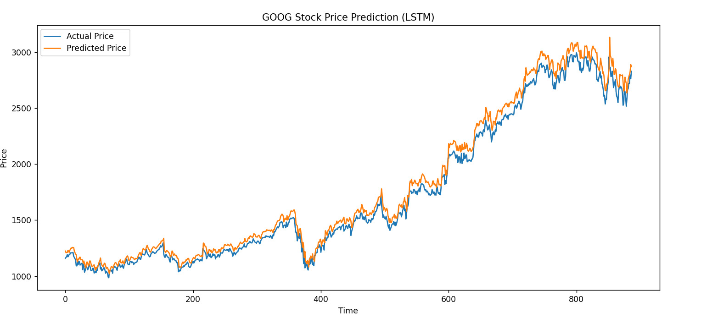

# Stock Price Prediction Using Recurrent Neural Networks (RNN)

## Overview
This project aims to predict future stock prices using Recurrent Neural Networks (RNN), a type of neural network that is well-suited for sequential data. The initial model will use RNNs in TensorFlow, with plans to explore Long Short-Term Memory (LSTM) networks for better performance in capturing long-term dependencies in stock price data.

## Project Setup

### Technologies Used:
- **TensorFlow**: A deep learning library used to implement and train the RNN model.
- **Keras**: High-level API to build the neural network in TensorFlow.
- **Pandas**: To handle and preprocess the dataset.
- **NumPy**: For numerical computations and data manipulation.
- **Matplotlib / Seaborn**: For data visualization.

### Current Dataset:
The stock data could be fetched from here https://www.kaggle.com/datasets/varpit94/google-stock-data?select=GOOGL.csv . The dataset include daily stock prices and key indicators like the following:
- **Open**: The price of the stock at market open.
- **Close**: The price of the stock at market close.
- **High**: The highest price reached during the trading day.
- **Low**: The lowest price reached during the trading day.
- **Volume**: The number of shares traded on a particular day.

## Objective
The goal is to train a model that can predict the **closing price** of a stock for the next day based on the previous day's data. We aim to explore the following tasks:
- **Preprocessing the dataset**: Normalization, handling missing data, and feature engineering.
- **Building an RNN model**: Initial tests with basic RNN architecture in TensorFlow.
- **Evaluating performance**: Using metrics such as Mean Absolute Error (MAE) or Root Mean Squared Error (RMSE).
- **Transitioning to LSTM and GRU models**: To handle longer sequences and improve accuracy.

## Stock Market Data Explanation
Stock market data generally includes several columns, each representing a specific aspect of the trading day:

1. **Open Price**:
   - The price of a stock when the market opens for the day. It’s often seen as a baseline for measuring the day's price movement.
  
2. **Close Price**:
   - The price of a stock when the market closes for the day. It’s considered the most important price as it reflects the value of the stock at the end of trading and is often used to compare price changes over time.

3. **High Price**:
   - The highest price at which a stock traded during the day. It can indicate the peak of demand during the trading session.

4. **Low Price**:
   - The lowest price at which a stock traded during the day. It reflects the lowest point the stock reached, showing the trough of trading activity.

5. **Volume**:
   - The number of shares traded during the day. A high volume often indicates strong investor interest, whereas low volume may suggest less market activity.

These features are used to understand the price action and trading dynamics of the stock. The model will attempt to predict future stock prices by learning from the past sequence of open, close, high, low, and volume data.

## Model Description

### Recurrent Neural Network (RNN)
RNNs are neural networks designed for sequence prediction tasks, such as time series forecasting. In this project, the RNN model will take a sequence of past stock prices and use them to predict future prices. The RNN has a hidden state that keeps track of information about previous time steps.

#### Transition to LSTM
Long Short-Term Memory (LSTM) networks are a special type of RNN that are particularly good at learning long-range dependencies. They mitigate issues such as the vanishing gradient problem and are well-suited for financial time-series data, which can have complex dependencies over long periods.

In future iterations of this project, we will experiment with LSTM models to see if they improve the accuracy of stock price predictions.

## Model Scripts Description

All StockPricePrediction models have basically the same structure, the only change between them are the layers that form the model.

## 🧠 Model Variants

Each script follows the same data processing pipeline, and only differs in the type of recurrent layers used:

| Script               | Layer Type   |
|----------------------|--------------|
| `RNN_StockPricePrediction.py`   | `SimpleRNN`  |
| `LSTM_StockPricePrediction.py`  | `LSTM`       |
| `GRU_StockPricePrediction.py`   | `GRU`        |

---

## 🧪 Features & Data

- Dataset: `GOOGL.csv` (historical stock prices)
- Input features: `Open`, `High`, `Low`, `Close`, `Volume`
- Sequence length: 60 days (lookback window) (120 for LSTM)
- Split: 80% training / 20% testing
- Scaling: `MinMaxScaler` (fitted only on training data)

---

## 📦 Dependencies

Make sure you have the following libraries installed:

```bash
pip install numpy pandas matplotlib scikit-learn tensorflow
```

---

## 🛠 How It Works

### 🔹 Data Preprocessing

```python
df = pd.read_csv('GOOGL.csv')
df['Date'] = pd.to_datetime(df['Date'])
df = df.sort_values('Date')

features = ['Open', 'High', 'Low', 'Close', 'Volume']
data = df[features]

scaler = MinMaxScaler()
scaler.fit(data[:training_size])

scaled_train = scaler.transform(data[:training_size])
scaled_test = scaler.transform(data[training_size - sequence_length:])
```

### 🔹 Sequence Generation

```python
for i in range(sequence_length, len(scaled_train)):
    x_train.append(scaled_train[i-sequence_length:i])
    y_train.append(scaled_train[i, features.index('Close')])
```

---

## 🔍 GRU Model Example

```python
from tensorflow.keras.models import Sequential
from tensorflow.keras.layers import GRU, Dropout, Dense

model = Sequential([
    GRU(128, return_sequences=True, input_shape=(x_train.shape[1], x_train.shape[2])),
    GRU(64),
    Dropout(0.5),
    Dense(1)
])

model.compile(optimizer='adam', loss='mean_squared_error')
model.fit(x_train, y_train, epochs=30, batch_size=32)
```

---

## 📈 Prediction & Evaluation

```python
predictions = model.predict(x_test)

# Inverse transform for readable prices
close_index = features.index('Close')
pred_full = np.zeros((len(predictions), len(features)))
true_full = np.zeros((len(y_test), len(features)))

pred_full[:, close_index] = predictions[:, 0]
true_full[:, close_index] = y_test

predictions_rescaled = scaler.inverse_transform(pred_full)[:, close_index]
y_test_rescaled = scaler.inverse_transform(true_full)[:, close_index]

# RMSE
rmse = np.sqrt(np.mean((predictions_rescaled - y_test_rescaled) ** 2))
print(f'RMSE: {rmse:.2f}')
```

---

## 📊 Results Visualization

```python
plt.figure(figsize=(14,6))
plt.plot(y_test_rescaled, label='Actual Price')
plt.plot(predictions_rescaled, label='Predicted Price')
plt.title('GOOG Stock Price Prediction')
plt.xlabel('Time')
plt.ylabel('Price')
plt.legend()
plt.show()
```

---

## 🏁 Results & Comparison

| Model     | Description                     | Pros                     | RMSE        |
|-----------|----------------------------------|---------------------------|----------------|
| RNN       | Basic recurrent network         | Simple, fast              | ~133.69           |
| LSTM      | Long Short-Term Memory          | Better for long sequences | ~162.84         |
| GRU       | Gated Recurrent Unit            | Fast, accurate            | ~73.44 ✅       |

> GRU often outperformed LSTM in this project, giving more stable predictions with less training time.

# RNN

# LSTM

# GRU


---

## 📌 Future Improvements

- Add technical indicators (e.g., RSI, MACD)
- Use Transformer-based models
- Incorporate multiple stocks or external economic data
- Hyperparameter tuning via Optuna or Keras Tuner

---

## ✨ Author

Made with 💡 by IAN BELTRAND.
